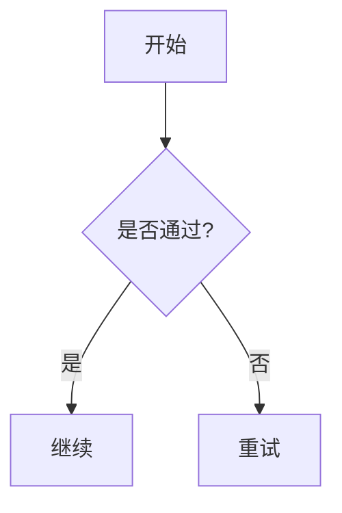
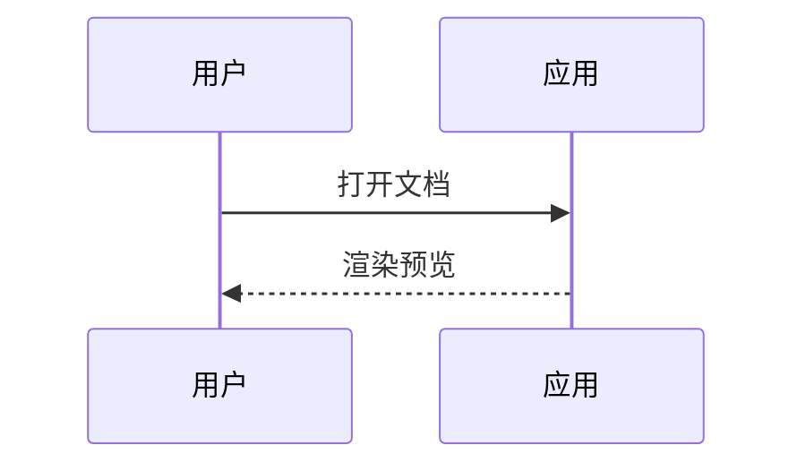
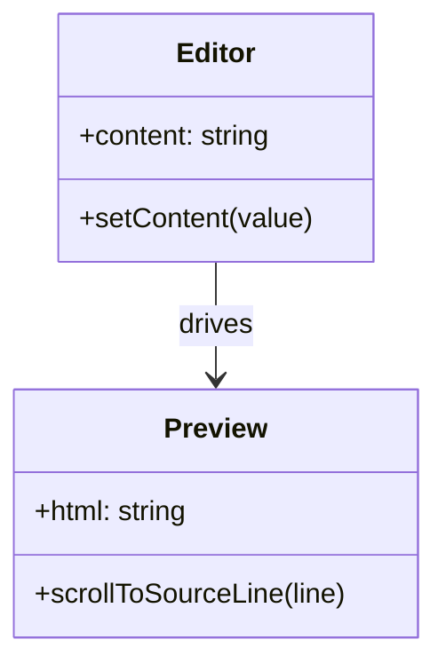

# Mermaid fixtures


```mermaid
flowchart TD
  Start[开始] --> Decision{是否通过?}
  Decision -->|是| Ok[继续]
  Decision -->|否| Retry[重试]
```


```mermaid
sequenceDiagram
  participant U as 用户
  participant A as 应用
  U->>A: 打开文档
  A-->>U: 渲染预览
```


```mermaid
classDiagram
  class Editor {
    +content: string
    +setContent(value)
  }
  class Preview {
    +html: string
    +scrollToSourceLine(line)
  }
  Editor --> Preview : drives
```

```js
console.log("ordinary code stays as code")
```

```mermaid
graph TD
  A ->
```
